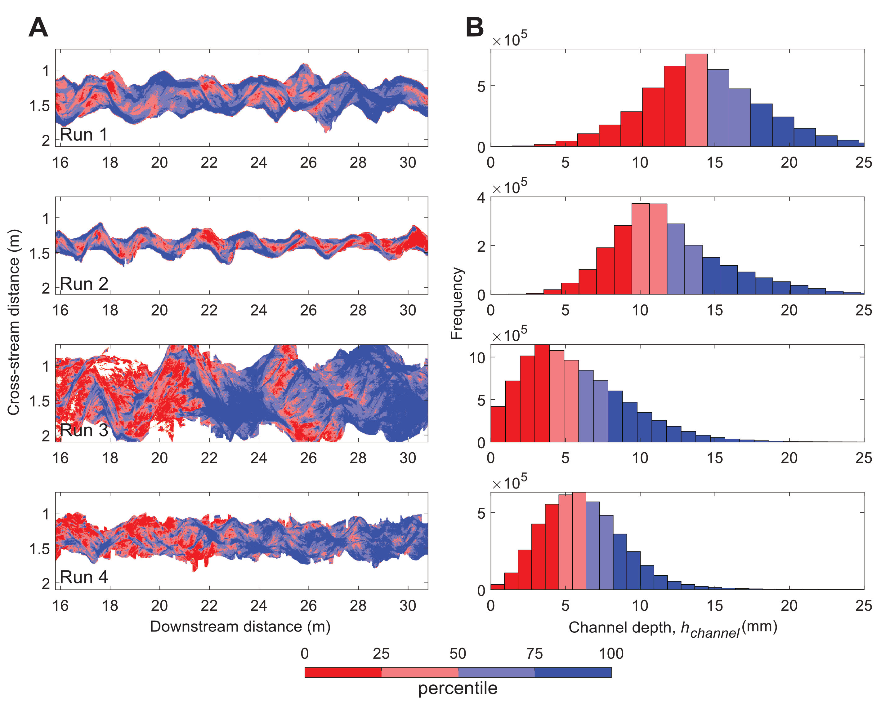
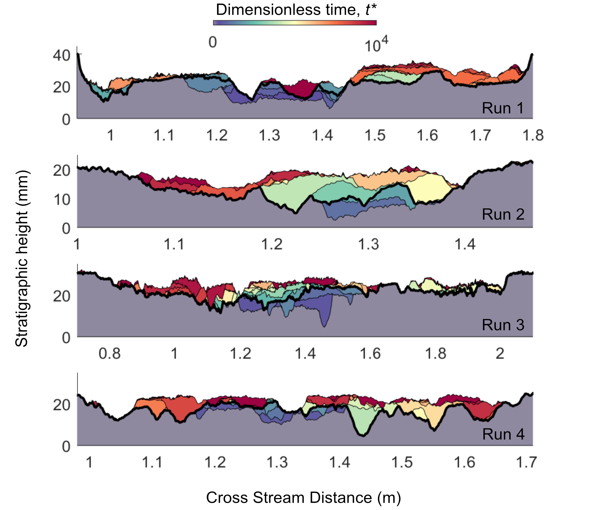

# Scour depth variability controls channel-scale stratigraphy in experimental braided rivers

### This is the data analysis from my first Ph.D. dissertation chapter looking at time series data from experimental braided channels. Original data was measured and collected by Limaye (2020) at St. Anthony Falls Laboratory. Using a series of four experiment runs, we examine how a two fold variation in water discharge and initial bed slope affect the spatiotemporal distribution of channel depths and deposit geometry. We also ran a reduced complexity flow depth to reconstruct flow depths. Below are some highlights of this study: 

  
  
Figure 1: Deepest scours correspond to zones of erosion at channel-belt margins and channel-thread confluences within the channel belt

  
  
Figure 2: Deepest scours correspond to zones of erosion at channel-belt margins and channel-thread confluences within the channel belt

